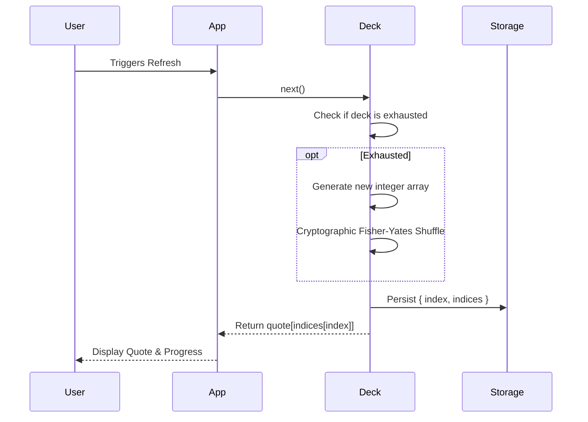
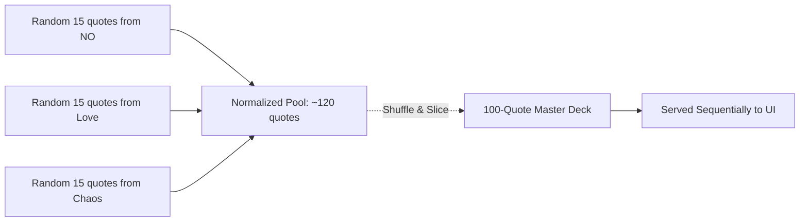

# QUIPLY - Tiny thoughts. Big personalities.

> *Wit, wisdom, and wonderfully questionable life advice — beautifully presented.*

Quiply is a minimalist quote app that pairs curated, hand-picked quotes with stunning full-screen photography. Pick a category, vibe out, copy or download the moment.

🌐 **Live:** [codebydusk.github.io/quiply](https://codebydusk.github.io/quiply)

---

## ✨ Features

- 🖼️ **Immersive backgrounds** — hi-res photos from [Lorem Picsum](https://picsum.photos/), sized to your screen and pixel density
- 🧠 **Persistent Cryptographic Shuffle** — Every category uses a unified, cryptographically secure shuffle deck. Your progress is saved locally, meaning you will *never* see repeats across sessions until you completely exhaust a category. The global "Random" mode merges all quotes into a massive master deck that automatically triggers a fresh shuffle every 24 hours.
- 📋 **Copy** — one tap to grab the quote text to your clipboard
- 📥 **Download / Share** — on desktop, saves a ready-to-share PNG. On mobile, instantly opens the native share sheet with the image.
- ⌨️ **Keyboard shortcuts** — press **Space** or **R** to refresh instantly
- 💾 **Remembers your category** — your last selection is saved locally
- 🌙 **Dark, glassmorphic UI** — clean, unobtrusive, and fully responsive

---

## For Users

**How to use it:**

1. Open the app.
2. Pick a category from the top-right menu (or let **Today's Quiply** surprise you).
3. Hit the **↻ refresh** button (or press **Space** / **R**) for a new quote + background.
4. Like what you see? Hit **copy** to grab the text, or **↓ download / share** to save it as a PNG (or share it directly on mobile).

*Note: You can track your progress through any deck by opening the category menu. The currently active category will display exactly how many quotes you've discovered and how many remain before it reshuffles!*

**Categories:**

| Group | Categories |
|---|---|
| Core | NO · Chaos · Questionable Decisions · Character Development |
| Relationships | Hopeless Romantic |
| Life | Corporate Survival · Friendly Fire · Today's Lies |
| Settings | Flush all (Resets all saved progress and clears local storage) |

Your last selected category and exact progress through the deck is automatically remembered for next time.

---

## For Developers

### Tech Stack

Quiply is intentionally simple — **zero dependencies, zero build steps.**

| Layer | Technology |
|---|---|
| Structure | Vanilla HTML5 |
| Styling | Vanilla CSS3 (custom properties, `backdrop-filter`, `clamp()`) |
| Logic | Vanilla JavaScript (ES2022+) |
| Images | [Lorem Picsum](https://picsum.photos/) — fetched as blob URLs |
| Fonts | Google Fonts — Cormorant Garamond (quotes) · Martel Sans (UI) |

### Project Structure

```
quiply/
├── index.html              # Single-page app shell
├── manifest.webmanifest    # PWA manifest
├── robots.txt
├── sitemap.xml
└── assets/
    ├── style.css           # All styles (fully commented)
    ├── script.js           # All logic (fully commented)
    ├── logo.svg            # App icon (SVG for quality)
    └── data/               # Quote databases (JSON arrays of strings)
        ├── bad_advice.json
        ├── chaos.json
        ├── emotional_damage.json
        ├── horoscope.json
        ├── insults.json
        ├── love.json
        ├── no.json
        └── office_excuses.json
```

### Local Development

Because Quiply uses `fetch()` to load JSON data assets, you can't open `index.html` directly via `file:///` (browser CORS policy blocks it). Serve it over a local HTTP server instead:

```bash
# Using npx (Node.js)
npx http-server . -p 8080

# Using bunx (Bun | https://bun.sh)
bunx http-server . -p 8080

# Or using Python
python -m http.server 8080
```

Then open `http://localhost:8080`.

### Core Architecture

Quiply is built around a robust, persistent state machine designed to make the experience feel exactly like drawing physical cards from a well-shuffled deck, guaranteeing no premature repeats and an equal distribution of quotes regardless of category size.

#### 1. Cryptographic Shuffling Engine

The random number generation is strictly decoupled from the weak, predictable `Math.random()`. A global `SecureRandom` block dynamically probes the browser environment and leverages the rigorous **Web Crypto API** if available (HTTPS/Localhost), gracefully downgrading to standard math randomness to prevent crashes during local insecure network testing.

```mermaid
graph TD
    A[SecureRandom Engine] --> B{Web Crypto API Available?}
    B -- Yes (HTTPS/Localhost) --> C[crypto.getRandomValues()]
    B -- No (HTTP LAN) --> D[Math.random()]
    C --> E[In-Place Fisher-Yates Shuffle]
    D --> E
```

#### 2. Persistent Decks (`ShuffleDeck`)

Instead of just randomly picking string elements from a JSON array, Quiply generates a lightweight array of integers mapping to the exact length of the category `[0, 1, 2 ... N]`. 

This integer array is shuffled, and items are dealt sequentially. A pointer (`index`) tracks exactly where the user left off. This extremely lightweight state object is committed to `localStorage` after every draw.



#### 3. The Global "Surprise Me!" Deck (`GlobalQuoteManager`)

The default category solves a common probability flaw in simplistic quote generators. If the engine first picked a random category and *then* a random quote, it would massively bias the results toward smaller categories. Conversely, simply flattening every file into one array biases the results toward the largest categories.

To solve this, Quiply uses an ephemeral `GlobalQuoteManager` that mathematically normalizes representation. It samples exactly 15 random quotes from *every* active JSON quote file, aggregates them into a unified pool, and then securely extracts a fresh, perfectly blended subset of 100 quotes. 

The `ShuffleDeck` then manages an integer map for this 100-quote subset. Once exhausted, a brand new permutation of 100 quotes is generated from scratch, meaning the "Random" mode stays endlessly fresh without repeating quotes within a session.



#### 4. Instant Blob Caching

`picsum.photos` URLs aggressively redirect on every request. To prevent the background image and the Canvas download from loading two different photos, the image is fetched once via `fetch()`, converted to an immutable `blob:` URL, and instantly reused for both CSS rendering and Canvas manipulation.

#### 5. Self-Healing State Recovery

The core `refresh()` lifecycle is wrapped in a resilient recovery layer. If the engine encounters *any* runtime failure (such as parsing a corrupted `localStorage` state injected by a third-party extension), it immediately catches the error, triggers the `flushAll()` logic to wipe the broken storage, and seamlessly attempts a fresh retry without exposing a crash to the user.

### Deployment

Quiply deploys to any static host. Just point the root of the repository as the publish directory.

- **GitHub Pages:** push to `main`, set Pages source to `/ (root)`.
- **Vercel / Netlify:** connect the repo, no build command needed.

---

## 🙏 Contributing — Help Grow the Quote Database!

The quotes are the heart of Quiply, and the database genuinely benefits from human voice over algorithmic output.

**We'd love your help adding more real, hand-written, non-AI quotes to any category.**

If you've got a sharp one-liner, a piece of chaotic wisdom, a roast that deserves to live forever, or advice so bad it's good — please open a **Pull Request**!

### How to contribute quotes

1. Fork this repository.
2. Open the relevant JSON file in `assets/data/`.
3. Add your quote(s) as plain strings to the array.
4. Open a PR with a short description of what you added.

**A few simple guidelines:**
- Quotes should be **original or in the public domain** — please don't submit copyrighted lines.
- **No AI-generated quotes.** The whole point is the human touch — messy, specific, and real.
- Keep them punchy. Shorter is usually better.
- One PR per category is easiest to review.

> All PRs will be reviewed and merged by [@codebydusk](https://github.com/codebydusk). Thank you in advance — every quote added makes Quiply a little more alive. 💛

---

## Acknowledgements

Quiply stands on the shoulders of some great open-source work:

- **[no-as-a-service](https://github.com/hotheadhacker/no-as-a-service)** by [@hotheadhacker](https://github.com/hotheadhacker) — the entire `NO` category is powered by this wonderful dataset. Thank you for making it open.
- **[i-cannot-do-that](https://github.com/teoc98/i-cannot-do-that)** by [@teoc98](https://github.com/teoc98) — a key inspiration for this project's spirit and format.
- **[quotd](https://github.com/codebydusk/quotd)** — an earlier project by the same author that Quiply grew out of, merged with the inspiration above.
- **[Lorem Picsum](https://picsum.photos/)** — beautiful, fast, free placeholder photography.

---

## License

This project is licensed under the **GNU General Public License v3.0** — see the [LICENSE](LICENSE) file for details.
