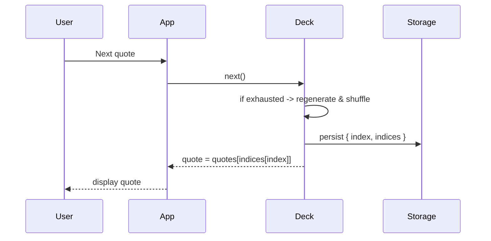
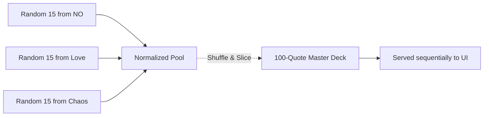

# Quiply

Tiny thoughts. Big personalities. Zero repeats.

A minimalist quote player with hand-curated packs, fullscreen photography, and a persistent shuffle engine that prevents repeats and ensures fair distribution.

Live demo: https://codebydusk.github.io/quiply

---

## Table of contents

- [Quick start](#quick-start)
- [Features](#features)
- [Project structure](#project-structure)
- [Contributing](#contributing)
- [For nerds](#for-nerds)
- [License](#license)

---

## Quick start

Clone and serve locally:

```bash
git clone https://github.com/codebydusk/quiply.git
cd quiply

# Using npx (Node.js)
npx http-server . -p 8080

# Or using Bun
bunx http-server . -p 8080

# Or using Python
python -m http.server 8080
```

Then open http://localhost:8080

---

## Features

- Persistent shuffle engine (no repeats until a deck is exhausted)
- Global "Today's Quiply" mode with mathematically fair sampling
- Hand-curated quote packs (humor, chaos, love, workplace, etc.)
- Immersive full-bleed photography via Lorem Picsum
- One-click copy + randomized success messages
- Download/share rendered PNG (mobile-friendly)
- Keyboard shortcuts (`Space`, `R`)
- Zero dependencies — plain HTML, CSS, and JavaScript

---

## Project structure

```text
quiply/
├── index.html
├── manifest.webmanifest
├── robots.txt
├── sitemap.xml
└── assets/
    ├── style.css
    ├── script.js
    ├── logo.svg
    └── data/  # JSON quote packs
```

---

## Contributing

Quip packs are the soul of Quiply — contributions welcome.

Guidelines:

- Keep quotes original (or public domain)
- No AI-generated content
- Short, punchy lines work best
- Edit the appropriate JSON in `assets/data/` and open a PR

See the `assets/data/` folder for existing categories and formats.

---

## For nerds

<details>
<summary>Architecture & implementation details (click to expand)</summary>

### Shuffle engine (overview)

Quiply treats each category as a shuffled integer deck. An index pointer is persisted to `localStorage`; when a deck is exhausted a new cryptographically shuffled permutation is produced.

### Secure randomness

When available (HTTPS / localhost), Quiply uses the Web Crypto API; otherwise it falls back to `Math.random()` to avoid crashes on insecure hosts.

```mermaid
graph TD
    A[SecureRandom Engine] --> B{Web Crypto API Available?}
    B -- "Yes (HTTPS/Localhost)" --> C[crypto.getRandomValues()]
    B -- "No (HTTP LAN)" --> D[Math.random()]
    C --> E[In-Place Fisher-Yates Shuffle]
    D --> E
```

### Persistent decks (`ShuffleDeck`)

Each deck is an array of integers `[0..N-1]`. The array is shuffled once and dealt sequentially. The current index and the permutation are saved to `localStorage` after each draw.



### Global "Today's Quiply" deck

To ensure fair sampling across categories the global manager samples a fixed number from each active pack, combines them, and then shuffles a master deck slice (default 100 quotes).



### Other details

- Blob caching: fetch image once, reuse blob URL for CSS + Canvas
- Self-healing: corrupt storage triggers `flushAll()` and a safe retry

</details>

---

## Acknowledgements

- no-as-a-service — `NO` dataset
- i-cannot-do-that — inspiration
- quotd — earlier project by the author
- Lorem Picsum — photography

---

## License

This project is licensed under the GNU GPLv3 — see [LICENSE](LICENSE).
