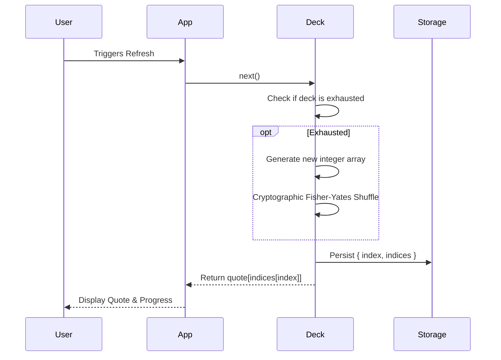
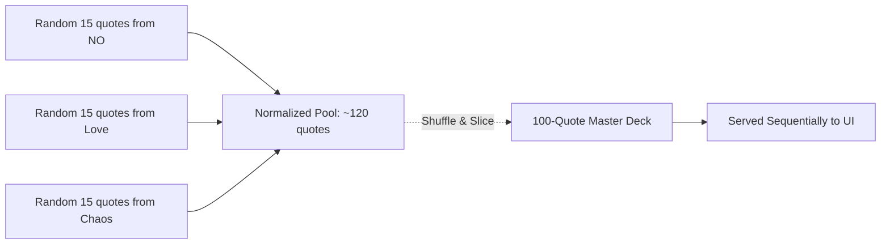

# QUIPLY

> **Quiply is what happens when a quote generator develops a personality.**
>
> *Tiny thoughts. Big personalities. Zero repeats.*

A minimalist quote experience featuring **original, hand-curated quote packs**, stunning full-screen photography, and a persistent shuffle engine that feels like drawing cards from a perfectly shuffled deck.

No repeated quotes.
No endless random loops.
Just beautifully presented thoughts.

🌐 **Live Demo:** https://codebydusk.github.io/quiply

---

## ✨ Features

- 🧠 **Persistent Shuffle Engine** — Every category behaves like a shuffled deck of cards. Quotes never repeat until the deck is exhausted.
- 🎲 **Today's Quiply** — A mathematically fair global shuffle where every quote has an equal chance of appearing.
- ✍️ **Original Quote Packs** — Thousands of curated quotes across humor, romance, chaos, workplace survival, and more.
- 🖼️ **Immersive Photography** — Beautiful full-screen backgrounds fetched dynamically from Lorem Picsum.
- 📋 **One-click Copy** — Complete with randomized copy-success messages.
- 📥 **Download / Share** — Save a beautifully rendered PNG or share directly on supported mobile browsers.
- 💾 **Persistent Progress** — Your categories, decks, and discoveries continue exactly where you left them.
- ⌨️ **Keyboard Shortcuts** — Press **Space** or **R** for the next quote.
- 🌙 **Zero Dependencies** — Pure HTML, CSS and JavaScript.

---

## 📦 Quote Packs

| Collection | Includes |
|------------|----------|
| 🌪 Core | NO · Chaos · Questionable Decisions · Character Development |
| ❤️ Relationships | Hopeless Romantic |
| 🎭 Life | Corporate Survival · Friendly Fire · Today's Lies |

More collections are planned.

---

## 🤔 Why Quiply?

Most quote generators repeatedly roll a random number.

That approach causes two problems:

- You often see the same quotes again and again.
- Smaller quote collections appear far more frequently than larger ones.

Quiply takes a different approach.

Every category is treated as a **shuffled deck**. Quotes are dealt one by one until every quote has been seen exactly once, creating a much more natural browsing experience.

The default **Today's Quiply** mode extends this concept even further by combining every quote pack into one global deck, giving every quote in the application the exact same mathematical probability of appearing.

---

## 🚀 Quick Start

```bash
git clone https://github.com/codebydusk/quiply.git
cd quiply

# Using npx (Node.js)
npx http-server . -p 8080

# Or using bunx (Bun | https://bun.sh)
bunx http-server . -p 8080

# Or using Python
python -m http.server 8080
````

Then open:

http://localhost:8080

---

## 🛠 Tech Stack

| Layer        | Technology                       |
| ------------ | -------------------------------- |
| UI           | Vanilla HTML5 + CSS3             |
| Logic        | Vanilla JavaScript (ES2022+)     |
| Images       | Lorem Picsum                     |
| Fonts        | Cormorant Garamond · Martel Sans |
| Dependencies | **None**                         |

---

## 📂 Project Structure

```text
quiply/
├── index.html
├── manifest.webmanifest
├── robots.txt
├── sitemap.xml
└── assets/
    ├── style.css
    ├── script.js
    ├── logo.svg
    └── data/
```

---

## ⚙️ Under the Hood

Quiply is intentionally simple, but the quote engine is surprisingly sophisticated.

### Persistent Shuffle Decks

Instead of randomly selecting quotes forever, Quiply creates an integer deck for every category, shuffles it once using *Fisher–Yates*, and persists the current position locally.

This guarantees:

* no premature repeats
* equal distribution
* instant O(1) retrieval
* seamless continuation across browser sessions

### Secure Randomness

Whenever available, Quiply uses the browser's **Web Crypto API** to generate unbiased shuffle permutations, automatically falling back to `Math.random()` when secure randomness isn't available.

### Today's Quiply

Rather than choosing a random category first, Quiply merges every quote pack into one global deck so that **every quote in the application has the same probability of appearing**, regardless of category size.

---

## ❤️ Contributing

The quote packs are the heart of Quiply.

If you have an original quote, a clever roast, chaotic wisdom, terrible advice, or anything delightfully memorable, we'd love a Pull Request.

Please keep submissions:

* Original (or public domain)
* Human-written
* Short and memorable
* Appropriate for the selected category

---

## For Nerds

### Core Architecture

Quiply is built around a robust, persistent state machine designed to make the experience feel exactly like drawing physical cards from a well-shuffled deck, guaranteeing no premature repeats and an equal distribution of quotes regardless of category size.

#### 1. Cryptographic Shuffling Engine

The random number generation is strictly decoupled from the weak, predictable `Math.random()`. A global `SecureRandom` block dynamically probes the browser environment and leverages the rigorous **Web Crypto API** if available (HTTPS/Localhost), gracefully downgrading to standard math randomness to prevent crashes during local insecure network testing.

```mermaid
graph TD
    A[SecureRandom Engine] --> B{Web Crypto API Available?}
    B -- Yes (HTTPS/Localhost) --> C[crypto.getRandomValues()]
    B -- No (HTTP LAN) --> D[Math.random()]
    C --> E[In-Place Fisher-Yates Shuffle]
    D --> E
```

#### 2. Persistent Decks (`ShuffleDeck`)

Instead of just randomly picking string elements from a JSON array, Quiply generates a lightweight array of integers mapping to the exact length of the category `[0, 1, 2 ... N]`.

This integer array is shuffled, and items are dealt sequentially. A pointer (`index`) tracks exactly where the user left off. This extremely lightweight state object is committed to `localStorage` after every draw.



#### 3. The Global "Today's Quiply" Deck (`GlobalQuoteManager`)

The default category solves a common probability flaw in simplistic quote generators. If the engine first picked a random category and *then* a random quote, it would massively bias the results toward smaller categories. Conversely, simply flattening every file into one array biases the results toward the largest categories.

To solve this, Quiply uses an ephemeral `GlobalQuoteManager` that mathematically normalizes representation. It samples exactly 15 random quotes from *every* active JSON quote file, aggregates them into a unified pool, and then securely extracts a fresh, perfectly blended subset of 100 quotes.

The `ShuffleDeck` then manages an integer map for this 100-quote subset. Once exhausted, a brand new permutation of 100 quotes is generated from scratch, meaning the "Random" mode stays endlessly fresh without repeating quotes within a session.



#### 4. Instant Blob Caching

`picsum.photos` URLs aggressively redirect on every request. To prevent the background image and the Canvas download from loading two different photos, the image is fetched once via `fetch()`, converted to an immutable `blob:` URL, and instantly reused for both CSS rendering and Canvas manipulation.

#### 5. Self-Healing State Recovery

The core `refresh()` lifecycle is wrapped in a resilient recovery layer. If the engine encounters *any* runtime failure (such as parsing a corrupted `localStorage` state injected by a third-party extension), it immediately catches the error, triggers the `flushAll()` logic to wipe the broken storage, and seamlessly attempts a fresh retry without exposing a crash to the user.

---

## 🙏 Contributing — Help Grow the Quote Database!

The quotes are the heart of Quiply, and the database genuinely benefits from human voice over algorithmic output.

**We'd love your help adding more real, hand-written, non-AI quotes to any category.**

If you've got a sharp one-liner, a piece of chaotic wisdom, a roast that deserves to live forever, or advice so bad it's good — please open a **Pull Request**!

### How to contribute quotes

1. Fork this repository.
2. Open the relevant JSON file in `assets/data/`.
3. Add your quote(s) as plain strings to the array.
4. Open a PR with a short description of what you added.

**A few simple guidelines:**
- Quotes should be **original or in the public domain** — please don't submit copyrighted lines.
- **No AI-generated quotes.** The whole point is the human touch — messy, specific, and real.
- Keep them punchy. Shorter is usually better.
- One PR per category is easiest to review.

> All PRs will be reviewed and merged by [@codebydusk](https://github.com/codebydusk). Thank you in advance — every quote added makes Quiply a little more alive. 💛

---

## Acknowledgements

Quiply stands on the shoulders of some great open-source work:

- **[no-as-a-service](https://github.com/hotheadhacker/no-as-a-service)** by [@hotheadhacker](https://github.com/hotheadhacker) — the entire `NO` category is powered by this wonderful dataset. Thank you for making it open.
- **[i-cannot-do-that](https://github.com/teoc98/i-cannot-do-that)** by [@teoc98](https://github.com/teoc98) — a key inspiration for this project's spirit and format.
- **[quotd](https://github.com/codebydusk/quotd)** — an earlier project by the same author that Quiply grew out of, merged with the inspiration above.
- **[Lorem Picsum](https://picsum.photos/)** — beautiful, fast, free placeholder photography.

---

## License

This project is licensed under the **GNU General Public License v3.0** — see the [LICENSE](LICENSE) file for details.
